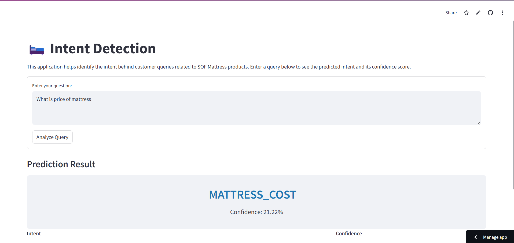

# Intent Detection for SOF Mattress

A machine learning-based intent detection system for customer queries related to SOF Mattress products. The system uses DistilBERT for natural language understanding and provides a user-friendly interface through Streamlit.

</img>

## Features

- Fast and accurate intent detection
- Real-time prediction with confidence scores
- User-friendly web interface
- RESTful API endpoint for integration
- Docker support for easy deployment

## Project Structure

```
.
├── api.py                 # FastAPI backend for intent detection
├── streamlit_app.py       # Streamlit frontend interface
├── requirements.txt       # Python package dependencies
├── Dockerfile            # Docker configuration for containerization
├── .dockerignore         # Docker build exclusions
├── train/                # Training related files
│   └── distilbert_model_trained/  # Trained model directory
│       └── model.pth     # Trained model weights
└── README.md             # Project documentation
```

## Setup and Installation

### Prerequisites

- Python 3.9 or higher
- Docker (optional, for containerized deployment)


### Local Setup

1. Clone the repository:
```bash
git clone https://github.com/namanomar/Intent-Detection
cd Intent-Detection
```

2. Install dependencies:
```bash
pip install -r requirements.txt
```

3. Model Training

The model is trained using DistilBERT. To retrain the model:

- Prepare your training data
- Run the training script 

```bash
cd train 
python train.py
```
- Save the model to `train/distilbert_model_trained/model.pth`

4. Run the FastAPI backend:
```bash
python app.py
```

5. In a separate terminal, run the Streamlit frontend:
```bash
streamlit run streamlit_app.py
```

### Docker Setup

1. Build the Docker image:
```bash
docker build -t intent-detection-api .
```

2. Run the container:
```bash
docker run -d -p 7860:7860 --name intent-detection intent-detection-api
```

## Usage

### Web Interface

1. Open your browser and navigate to `http://localhost:8501`
2. Enter your query in the text area
3. Click "Analyze Query" or press Enter
4. View the predicted intent and confidence score

### API Usage

The FastAPI endpoint is available at `http://localhost:7860/predict`

Example API call:
```bash
curl -X POST "http://localhost:7860/predict" \
     -H "Content-Type: application/json" \
     -d '{"text": "What is the price of your mattress?", "top_k": 1}'
```

API Response format:
```json
{
    "predictions": [
        {
            "label": "LABEL_12",
            "actual_label": "MATTRESS_COST",
            "confidence": 0.95
        }
    ],
    "top_prediction": {
        "label": "LABEL_12",
        "actual_label": "MATTRESS_COST",
        "confidence": 0.95
    }
}
```

## Supported Intents

The system can detect the following intents:
- EMI
- COD
- ORTHO_FEATURES
- ERGO_FEATURES
- COMPARISON
- WARRANTY
- 100_NIGHT_TRIAL_OFFER
- SIZE_CUSTOMIZATION
- WHAT_SIZE_TO_ORDER
- LEAD_GEN
- CHECK_PINCODE
- DISTRIBUTORS
- MATTRESS_COST
- PRODUCT_VARIANTS
- ABOUT_SOF_MATTRESS
- DELAY_IN_DELIVERY
- ORDER_STATUS
- RETURN_EXCHANGE
- CANCEL_ORDER
- PILLOWS
- OFFERS

## API Documentation

- Swagger UI: `http://localhost:7860/docs`

